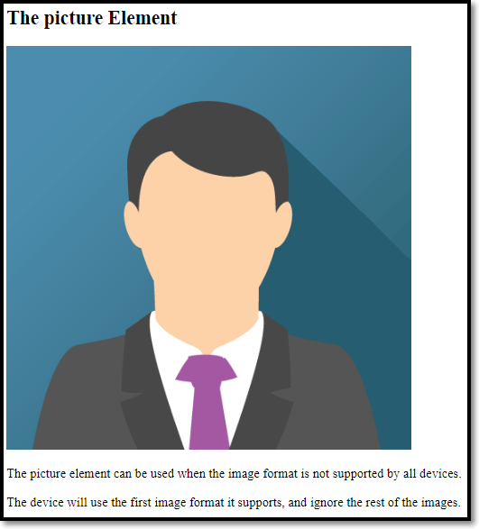

# HTML5

## 기본 형태

```html
<!DOCTYPE html>
<html>
  <head>
    <title>Page Title</title>
  </head>
  <body>
    <h1>My First Heading</h1>
    <p>My first paragraph.</p>
  </body>
</html>
```

- **\<!DOCTYPE html>** 선언

웹 브라우저에게 HTML5라는 것을 알려준다.

- Comment
```html
<!-- Write your comments here -->
```

## 주요 태그

### HTML Headings

HTML headings are defined with the \<h1> to \<h6> tags.
```html
<h1>This is heading 1</h1>
<h2>This is heading 2</h2>
<h3>This is heading 3</h3>
```

### HTML Paragraphs
HTML에서 보여질 때 띄어쓰기가 여러번 되어 있어도 한번만 인식되고 엔터키도 무시한다.

```html
<p>This is a paragraph.</p>
<p>This is another paragraph.</p>
```
```html
<p>
This paragraph
contains a lot of lines
in the source code,
but the browser
ignores it.
</p>

**Display**
------------------------
This paragraph contains a lot of lines in the source code, but the browser ignores it.
------------------------
<p>
This paragraph
contains         a lot of spaces
in the source         code,
but the        browser
ignores it.
</p>

**Display**
------------------------
This paragraph contains a lot of spaces in the source code, but the browser ignores it.
------------------------
```
만일 내가 타이핑한대로 그대로 보이게 하고 싶으면 \<pre> 태그를 쓰자

### HTML Links
```html
<a href="https://www.w3schools.com">This is a link</a>
```
By default, the linked page will be displayed in the current browser window. To change this, you must specify another target for the link.

The target attribute specifies where to open the linked document.

The target attribute can have one of the following values:

<span style="color:red">`_self`</span> - Default. Opens the document in the same window/tab as it was clicked

<span style="color:red">`_blank`</span> - Opens the document in a new window or tab

<span style="color:red">`_parent`</span> - Opens the document in the parent frame

<span style="color:red">`_top`</span> - Opens the document in the full body of the window

```html
<a href="https://www.w3schools.com/" target="_blank">Visit W3Schools!</a>
```

 - 북마크
```html
<a href="#C4">Jump to Chapter 4</a>
```

### HTML Images

```html

```
The width, height, and style attributes are all valid in HTML.

However, we suggest using the style attribute. It prevents styles sheets from changing the size of images:
```html


```

 - Image Map
```html


<map name="workmap">
  <area shape="rect" coords="34,44,270,350" alt="Computer" href="computer.htm">
  <area shape="rect" coords="290,172,333,250" alt="Phone" href="phone.htm">
  <area shape="circle" coords="337,300,44" alt="Coffee" href="coffee.htm">
</map>
```


<span style="color:blue">**`rect`**</span> - defines a rectangular region

<span style="color:blue">**`circle`**</span> - defines a circular region

<span style="color:blue">**`poly`**</span> - defines a polygonal region

<span style="color:blue">**`default`**</span> - defines the entire region

 - HTML **\<picture>** Element


```html
<picture>
  <source media="(min-width: 650px)" srcset="img_food.jpg">
  <source media="(min-width: 465px)" srcset="img_car.jpg">
  
</picture>

```
\<picture> 태그를 사용하는 예시
```html
<!DOCTYPE html>
<html>
<head>
<meta name="viewport" content="width=device-width, initial-scale=1.0">
</head>
<body>

<h2>The picture Element</h2>

<picture>
  <source srcset="img_avatar.png">
  <source srcset="img_girl.jpg">
  
</picture>

<p>The picture element can be used when the image format is not supported by all devices.</p>

<p>The device will use the first image format it supports, and ignore the rest of the images.</p>

</body>
</html>
```



### 수평선과 개행 태그
```html
<hr> 수평선
<br> 개행
```

## 주요 개념

### HTML Elements

- The HTML element is everything from the start tag to the end tag:

```html
<tagname>Content goes here...</tagname>
```

- Empty HTML Elements

```html
<p>
  This is a <br>
  paragraph with a line break.
</p>
```

- HTML is Not Case Sensitive
  \<P> means the same as \<p>.

### HTML Attributes

1. All HTML elements can have attributes
1. Attributes provide additional information about elements
1. Attributes are always specified in the start tag
1. Attributes usually come in name/value pairs like: name="value"

_Example)_

```html
<a href="https://www.w3schools.com">Visit W3Schools</a>

<p style="color:red;">This is a red paragraph.</p>
<p title="I'm a tooltip">This is a paragraph.</p>
```

- Lang 속성

You should always include the lang attribute inside the \<html> tag, to declare the language of the Web page. This is meant to assist search engines and browsers.

```html
<html lang="en">
```

 - 속성사용시 주의 사항

```html
Good case
<a href="https://www.w3schools.com/html/">Visit our HTML tutorial</a>

Bad case
<a href=https://www.w3schools.com/html/>Visit our HTML tutorial</a>

Why bad?
<p title=About W3Schools>
```

**Single or Double Quotes?**

보통은 Double Quotes(쌍따옴표")를 쓰지만 Single Quotes(홑따옴표")도 가능하다.
```html
<p title='John "ShotGun" Nelson'>
<p title="John 'ShotGun' Nelson">
```