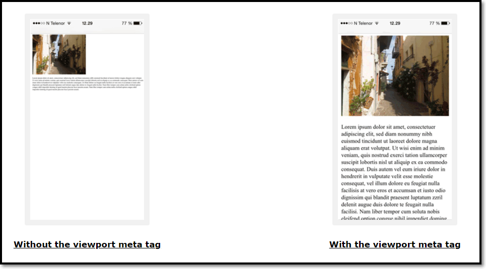

# HTML 유용한 지식

## HTML Table
```html
<table style="width:100%">
  <tr>
    <th>Firstname</th>
    <th>Lastname</th>
    <th>Age</th>
  </tr>
  <tr>
    <td>Jill</td>
    <td>Smith</td>
    <td>50</td>
  </tr>
  <tr>
    <td>Eve</td>
    <td>Jackson</td>
    <td>94</td>
  </tr>
</table>
```
### Cell that Span Many Columns

```html
<table style="width:100%">
  <tr>
    <th>Name</th>
    <th colspan="2">Telephone</th>
  </tr>
  <tr>
    <td>Bill Gates</td>
    <td>55577854</td>
    <td>55577855</td>
  </tr>
</table>
```

### HTML Table - Cell that Span Many Rows
```html
<table style="width:100%">
  <tr>
    <th>Name:</th>
    <td>Bill Gates</td>
  </tr>
  <tr>
    <th rowspan="2">Telephone:</th>
    <td>55577854</td>
  </tr>
  <tr>
    <td>55577855</td>
  </tr>
</table>
```

### HTML Table - Add a Caption
```html
<table style="width:100%">
  <caption>Monthly savings</caption>
  <tr>
    <th>Month</th>
    <th>Savings</th>
  </tr>
  <tr>
    <td>January</td>
    <td>$100</td>
  </tr>
  <tr>
    <td>February</td>
    <td>$50</td>
  </tr>
</table>
```
#### *CSS 활용팁*
 - Use the CSS `border` property to define a border
 - Use the CSS `border-collapse` property to collapse cell borders
 - Use the CSS `padding` property to add padding to cells
 - Use the CSS `text-align` property to align cell text
 - Use the CSS `border-spacing` property to set the spacing between cells

#### *속성 활용팁*
- Use the `colspan` attribute to make a cell span many columns
- Use the `rowspan` attribute to make a cell span many rows
- Use the `id` attribute to uniquely define one table

## HTML List
- unordered list

`list-style-type`
|Value|Description|
|:---|:---|
|disc|	Sets the list item marker to a bullet (default)|
|circle|	Sets the list item marker to a circle|
|square|	Sets the list item marker to a square|
|none|	The list items will not be marked|

```html
<ul style="list-style-type:disc;">
  <li>Coffee</li>
  <li>Tea</li>
  <li>Milk</li>
</ul>
```
*활용 사례 : Horizontal List with CSS*
```html
<!DOCTYPE html>
<html>
<head>
<style>
ul {
  list-style-type: none;
  margin: 0;
  padding: 0;
  overflow: hidden;
  background-color: #333333;
}

li {
  float: left;
}

li a {
  display: block;
  color: white;
  text-align: center;
  padding: 16px;
  text-decoration: none;
}

li a:hover {
  background-color: #111111;
}
</style>
</head>
<body>

<ul>
  <li><a href="#home">Home</a></li>
  <li><a href="#news">News</a></li>
  <li><a href="#contact">Contact</a></li>
  <li><a href="#about">About</a></li>
</ul>

</body>
</html>
```

- ordered list

`type`, `start`

|Value|Description|
|:---|:---|
|type="1"|The list items will be numbered with numbers (default)|
|type="A"|The list items will be numbered with uppercase letters|
|type="a"|The list items will be numbered with lowercase letters|
|type="I"|The list items will be numbered with uppercase roman numbers|
|type="i"|The list items will be numbered with lowercase roman numbers|
	

```html
<ol type="1">
  <li>Coffee</li>
  <li>Tea</li>
  <li>Milk</li>
</ol>
```

## HTML Block-level Elements and Inline Elements

The `<div>` element is a block-level element.

The `<span>` element is a Inline-level element.

### About \<div> tag

The \<div> element is often used as a container for other HTML elements.

The \<div> element has no required attributes, but style, class and id are common.

When used together with CSS, the \<div> element can be used to style blocks of content:

```html
<div style="background-color:black;color:white;padding:20px;">
  <h2>London</h2>
  <p>London is the capital city of England. It is the most populous city in the United Kingdom, with a metropolitan area of over 13 million inhabitants.</p>
</div>
```

### About \<span> tag

The `<span>` element is an inline container used to mark up a part of a text, or a part of a document.

The `<span>` element has no required attributes, but style, class and id are common.

When used together with CSS, the `<span>` element can be used to style parts of the text:

```html
<p>My mother has <span style="color:blue;font-weight:bold">blue</span> eyes and my father has <span style="color:darkolivegreen;font-weight:bold">dark green</span> eyes.</p>
```

## 속성 : class
The HTML class attribute is used to specify a class for an HTML element.

Multiple HTML elements can share the same class.

```html
<!DOCTYPE html>
<html>
<head>
<style>
.city {
  background-color: tomato;
  color: white;
  border: 2px solid black;
  margin: 20px;
  padding: 20px;
}
</style>
</head>
<body>

<div class="city">
  <h2>London</h2>
  <p>London is the capital of England.</p>
</div>

<div class="city">
  <h2>Paris</h2>
  <p>Paris is the capital of France.</p>
</div>

<div class="city">
  <h2>Tokyo</h2>
  <p>Tokyo is the capital of Japan.</p>
</div>

</body>
</html>
```

## 속성 : id
The HTML id attribute is used to specify a unique id for an HTML element.

You cannot have more than one element with the same id in an HTML document.

```html
<!DOCTYPE html>
<html>
<head>
<style>
#myHeader {
  background-color: lightblue;
  color: black;
  padding: 40px;
  text-align: center;
}
</style>
</head>
<body>

<h1 id="myHeader">My Header</h1>

</body>
</html>
```

## \<head> 안에 들어갈 정보들
HTML metadata is data about the HTML document. Metadata is not displayed.

Metadata typically define the document title, character set, styles, scripts, and other meta information.

**Define the character set used:**
```html
<meta charset="UTF-8">
```
**Define keywords for search engines:**
```html
<meta name="keywords" content="HTML, CSS, JavaScript">
```
**Define a description of your web page:**
```html
<meta name="description" content="Free Web tutorials">
```
**Define the author of a page:**
```html
<meta name="author" content="John Doe">
```
**Refresh document every 30 seconds:**
```html
<meta http-equiv="refresh" content="30">
```
**Setting the viewport to make your website look good on all devices:**
```html
<meta name="viewport" content="width=device-width, initial-scale=1.0">
```

### Setting The Viewport
The viewport is the user's visible area of a web page. It varies with the device - it will be smaller on a mobile phone than on a computer screen.

You should include the following `<meta>` element in all your web pages:
```html
<meta name="viewport" content="width=device-width, initial-scale=1.0">
```
This gives the browser instructions on how to control the page's dimensions and scaling.

The `width=device-width` part sets the width of the page to follow the screen-width of the device (which will vary depending on the device).

The `initial-scale=1.0` part sets the initial zoom level when the page is first loaded by the browser.

Here is an example of a web page without the viewport meta tag, and the same web page with the viewport meta tag:


## HTML Layout Techniques

There are four different techniques to create multicolumn layouts. Each technique has its pros and cons:

 - CSS framework
 - CSS float property
 - CSS flexbox
 - CSS grid

### CSS Frameworks
If you want to create your layout fast, you can use a CSS framework, like W3.CSS or Bootstrap.

### CSS Float Layout
It is common to do entire web layouts using the CSS float property. Float is easy to learn - you just need to remember how the float and clear properties work. Disadvantages: Floating elements are tied to the document flow, which may harm the flexibility.

```html
<!DOCTYPE html>
<html lang="en">
<head>
<title>CSS Template</title>
<meta charset="utf-8">
<meta name="viewport" content="width=device-width, initial-scale=1">
<style>
* {
  box-sizing: border-box;
}

body {
  font-family: Arial, Helvetica, sans-serif;
}

/* Style the header */
header {
  background-color: #666;
  padding: 30px;
  text-align: center;
  font-size: 35px;
  color: white;
}

/* Create two columns/boxes that floats next to each other */
nav {
  float: left;
  width: 30%;
  height: 300px; /* only for demonstration, should be removed */
  background: #ccc;
  padding: 20px;
}

/* Style the list inside the menu */
nav ul {
  list-style-type: none;
  padding: 0;
}

article {
  float: left;
  padding: 20px;
  width: 70%;
  background-color: #f1f1f1;
  height: 300px; /* only for demonstration, should be removed */
}

/* Clear floats after the columns */
section:after {
  content: "";
  display: table;
  clear: both;
}

/* Style the footer */
footer {
  background-color: #777;
  padding: 10px;
  text-align: center;
  color: white;
}

/* Responsive layout - makes the two columns/boxes stack on top of each other instead of next to each other, on small screens */
@media (max-width: 600px) {
  nav, article {
    width: 100%;
    height: auto;
  }
}
</style>
</head>
<body>

<h2>CSS Layout Float</h2>
<p>In this example, we have created a header, two columns/boxes and a footer. On smaller screens, the columns will stack on top of each other.</p>
<p>Resize the browser window to see the responsive effect (you will learn more about this in our next chapter - HTML Responsive.)</p>

<header>
  <h2>Cities</h2>
</header>

<section>
  <nav>
    <ul>
      <li><a href="#">London</a></li>
      <li><a href="#">Paris</a></li>
      <li><a href="#">Tokyo</a></li>
    </ul>
  </nav>
  
  <article>
    <h1>London</h1>
    <p>London is the capital city of England. It is the most populous city in the  United Kingdom, with a metropolitan area of over 13 million inhabitants.</p>
    <p>Standing on the River Thames, London has been a major settlement for two millennia, its history going back to its founding by the Romans, who named it Londinium.</p>
  </article>
</section>

<footer>
  <p>Footer</p>
</footer>

</body>
</html>
```

### CSS Flexbox Layout

Use of flexbox ensures that elements behave predictably when the page layout must accommodate different screen sizes and different display devices.

```html
<!DOCTYPE html>
<html lang="en">
<head>
<title>CSS Template</title>
<meta charset="utf-8">
<meta name="viewport" content="width=device-width, initial-scale=1">
<style>
* {
  box-sizing: border-box;
}

body {
  font-family: Arial, Helvetica, sans-serif;
}

/* Style the header */
header {
  background-color: #666;
  padding: 30px;
  text-align: center;
  font-size: 35px;
  color: white;
}

/* Container for flexboxes */
section {
  display: -webkit-flex;
  display: flex;
}

/* Style the navigation menu */
nav {
  -webkit-flex: 1;
  -ms-flex: 1;
  flex: 1;
  background: #ccc;
  padding: 20px;
}

/* Style the list inside the menu */
nav ul {
  list-style-type: none;
  padding: 0;
}

/* Style the content */
article {
  -webkit-flex: 3;
  -ms-flex: 3;
  flex: 3;
  background-color: #f1f1f1;
  padding: 10px;
}

/* Style the footer */
footer {
  background-color: #777;
  padding: 10px;
  text-align: center;
  color: white;
}

/* Responsive layout - makes the menu and the content (inside the section) sit on top of each other instead of next to each other */
@media (max-width: 600px) {
  section {
    -webkit-flex-direction: column;
    flex-direction: column;
  }
}
</style>
</head>
<body>

<h2>CSS Layout Flexbox</h2>
<p>In this example, we have created a header, two columns/boxes and a footer. On smaller screens, the columns will stack on top of each other.</p>
<p>Resize the browser window to see the responsive effect.</p>
<p><strong>Note:</strong> Flexbox is not supported in Internet Explorer 10 and earlier versions.</p>

<header>
  <h2>Cities</h2>
</header>

<section>
  <nav>
    <ul>
      <li><a href="#">London</a></li>
      <li><a href="#">Paris</a></li>
      <li><a href="#">Tokyo</a></li>
    </ul>
  </nav>
  
  <article>
    <h1>London</h1>
    <p>London is the capital city of England. It is the most populous city in the  United Kingdom, with a metropolitan area of over 13 million inhabitants.</p>
    <p>Standing on the River Thames, London has been a major settlement for two millennia, its history going back to its founding by the Romans, who named it Londinium.</p>
  </article>
</section>

<footer>
  <p>Footer</p>
</footer>

</body>
</html>

```
### CSS Grid Layout

The CSS Grid Layout Module offers a grid-based layout system, with rows and columns, making it easier to design web pages without having to use floats and positioning.

## 반응형 웹페이지 제작

```html
<!DOCTYPE html>
<html>
<head>
<meta name="viewport" content="width=device-width, initial-scale=1.0">
<style>
* {
  box-sizing: border-box;
}
.menu {
  float: left;
  width: 20%;
}
.menuitem {
  padding: 8px;
  margin-top: 7px;
  border-bottom: 1px solid #f1f1f1;
}
.main {
  float: left;
  width: 60%;
  padding: 0 20px;
  overflow: hidden;
}
.right {
  background-color: lightblue;
  float: left;
  width: 20%;
  padding: 10px 15px;
  margin-top: 7px;
}

@media only screen and (max-width:800px) {
  /* For tablets: */
  .main {
    width: 80%;
    padding: 0;
  }
  .right {
    width: 100%;
  }
}
@media only screen and (max-width:500px) {
  /* For mobile phones: */
  .menu, .main, .right {
    width: 100%;
  }
}
</style>
</head>
<body style="font-family:Verdana;">

<div style="background-color:#f1f1f1;padding:15px;">
  <h1>Cinque Terre</h1>
  <h3>Resize the browser window</h3>
</div>

<div style="overflow:auto">
  <div class="menu">
    <div class="menuitem">The Walk</div>
    <div class="menuitem">Transport</div>
    <div class="menuitem">History</div>
    <div class="menuitem">Gallery</div>
  </div>

  <div class="main">
    <h2>The Walk</h2>
    <p>The walk from Monterosso to Riomaggiore will take you approximately two hours, give or take an hour depending on the weather conditions and your physical shape.</p>
    
  </div>

  <div class="right">
    <h2>What?</h2>
    <p>Cinque Terre comprises five villages: Monterosso, Vernazza, Corniglia, Manarola, and Riomaggiore.</p>
    <h2>Where?</h2>
    <p>On the northwest cost of the Italian Riviera, north of the city La Spezia.</p>
    <h2>Price?</h2>
    <p>The Walk is free!</p>
  </div>
</div>


<div style="background-color:#f1f1f1;text-align:center;padding:10px;margin-top:7px;font-size:12px;"> This web page is a part of a demonstration of fluid web design made by w3schools.com. Resize the browser window to see the content respond to the resizing.</div>

</body>
</html>
```

반응형 웹사이트를 만들기 위해서는 먼저 viewport를 추가해야 한다.
```html
<meta name="viewport" content="width=device-width, initial-scale=1.0">
```
* Responsive 이미지

If the CSS width property is set to 100%, the image will be responsive and scale up and down
```html

```
Notice that in the example above, the image can be scaled up to be larger than its original size. A better solution, in many cases, will be to use the max-width property instead.
```html

```
**Show Different Images Depending on Browser Width**

The HTML `<picture>` element allows you to define different images for different browser window sizes.

Resize the browser window to see how the image below change depending on the width:

```html
<picture>
  <source srcset="img_smallflower.jpg" media="(max-width: 600px)">
  <source srcset="img_flowers.jpg" media="(max-width: 1500px)">
  <source srcset="flowers.jpg">
  
</picture>
```
 - Responsive 텍스트

The text size can be set with a "vw" unit, which means the "viewport width".

```html
<h1 style="font-size:10vw">Hello World</h1>
```

 - Media Queries

In addition to resize text and images, it is also common to use media queries in responsive web pages.

With media queries you can define completely different styles for different browser sizes.

```html
<!DOCTYPE html>
<html>
<head>
<meta name="viewport" content="width=device-width, initial-scale=1.0">
<style>
* {
  box-sizing:border-box;
}

.left {
  background-color:#2196F3;
  padding:20px;
  float:left;
  width:20%; /* The width is 20%, by default */
}

.main {
  background-color:#f1f1f1;
  padding:20px;
  float:left;
  width:60%; /* The width is 60%, by default */
}

.right {
  background-color:#4CAF50;
  padding:20px;
  float:left;
  width:20%; /* The width is 20%, by default */
}

/* Use a media query to add a break point at 800px: */
@media screen and (max-width:800px) {
  .left, .main, .right {
    width:100%; /* The width is 100%, when the viewport is 800px or smaller */
  }
}
</style>
</head>
<body>

<h2>Media Queries</h2>
<p>Resize the browser window.</p>

<p>Make sure you reach the breakpoint at 800px when resizing this frame.</p>

<div class="left">
  <p>Left Menu</p>
</div>

<div class="main">
  <p>Main Content</p>
</div>

<div class="right">
  <p>Right Content</p>
</div>

</body>
</html>
```

