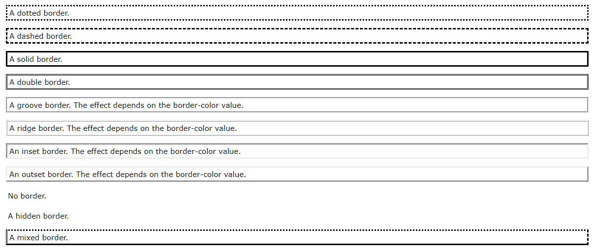
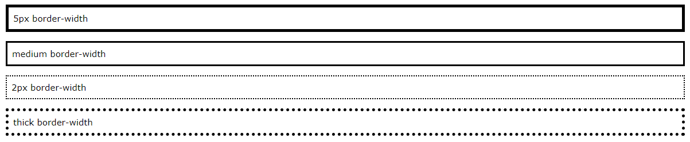
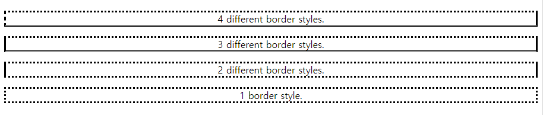

# 💻 CSS 맛보기

## 1. Syntax

### - Selector, Declaration, Property, Value

```css
h1 <== Selector {
    color:blue; <== Declaration
    Property : Value;
}
/* 주석 Comments */
```

<br><br><br><br><br>
<br><br><br><br><br>

## 2. Selectors

### The CSS element Selector

```css
p {
  text-align: center;
  color: red;
}
```

### The CSS id Selector

```css
#para1 {
  text-align: center;
  color: red;
}
```

### The CSS class Selector

```css
.center {
  text-align: center;
  color: red;
}
```

### The CSS Universal Selector

```css
* {
  text-align: center;
  color: blue;
}
```

### The CSS Grouping Selector

```css
h1, h2, p {
  text-align: center;
  color: red;
}
```

<br><br><br><br><br>
<br><br><br><br><br>

## 3. How To Use CSS

### External CSS

```html
<!DOCTYPE html>
<html>
<head>
<link rel="stylesheet" href="mystyle.css">
</head>
<body>

<h1>This is a heading</h1>
<p>This is a paragraph.</p>

</body>
</html>
```

 - mystyle.css

```css
body {
  background-color: lightblue;
}

h1 {
  color: navy;
  margin-left: 20px;
}
```

### Internal CSS

```html
<!DOCTYPE html>
<html>
<head>
<style>
body {
  background-color: linen;
}

h1 {
  color: maroon;
  margin-left: 40px;
}
</style>
</head>
<body>

<h1>This is a heading</h1>
<p>This is a paragraph.</p>

</body>
</html>
```

### Inline CSS

```html
<!DOCTYPE html>
<html>
<body>

<h1 style="color:blue;text-align:center;">This is a heading</h1>
<p style="color:red;">This is a paragraph.</p>

</body>
</html>
```

#### 우선순위

 1. Inline style (inside an HTML element)
 1. External and internal style sheets (in the head section)
 1. Browser default


<br><br><br><br><br>
<br><br><br><br><br>

## 4. CSS 색깔 다루기

### `background-color` (Background Color)

```html
<h1 style="background-color:DodgerBlue;">Hello World</h1>
<p style="background-color:Tomato;">Lorem ipsum...</p>
```

### `color` (Text Color)

```html
<h1 style="color:Tomato;">Hello World</h1>
<p style="color:DodgerBlue;">Lorem ipsum...</p>
<p style="color:MediumSeaGreen;">Ut wisi enim...</p>
```

### `border` (Border Color)

```html
<h1 style="border:2px solid Tomato;">Hello World</h1>
<h1 style="border:2px solid DodgerBlue;">Hello World</h1>
<h1 style="border:2px solid Violet;">Hello World</h1>
```

### Color Values

 - rgb(255, 99, 71)
 - #ff6347
 - hsl(9, 100%, 64%)
 - rgba(255, 99, 71, 0.5)
 - hsla(9, 100%, 64%, 0.5)

<br><br><br><br><br>
<br><br><br><br><br>

## 5. Backgrounds 다루기

### Background Color

```css
div {
  background-color: green;
  opacity: 0.3;
}
```

### Background Image

```css
body {
  background-image: url("paper.gif");
}
```


```css
body {
  background-image: url("gradient_bg.png");
  background-repeat: repeat-x; /*오직 수평으로만 반복, 수직:repeat-y, 반복X:no-repeat*/
}
```

```css
body {
  background-image: url("img_tree.png");
  background-repeat: no-repeat;
  background-position: right top; /*그림 위치*/
}
```


### Background Attachment

```css
body {
  background-image: url("img_tree.png");
  background-repeat: no-repeat;
  background-position: right top;
  background-attachment: fixed;
}
```

```css
body {
  background-image: url("img_tree.png");
  background-repeat: no-repeat;
  background-position: right top;
  background-attachment: scroll;
}
```

### Shorthand property

```css
body {
  background-color: #ffffff;
  background-image: url("img_tree.png");
  background-repeat: no-repeat;
  background-position: right top;
}
```

```css
body {
  background: #ffffff url("img_tree.png") no-repeat right top;
}
```

<br><br><br><br><br>
<br><br><br><br><br>

## 6. Borders

### border-style

 - dotted - Defines a dotted border
 - dashed - Defines a dashed border
 - solid - Defines a solid border
 - double - Defines a double border
 - groove - Defines a 3D grooved border. The effect depends on the border-color value
 - ridge - Defines a 3D ridged border. The effect depends on the border-color value
 - inset - Defines a 3D inset border. The effect depends on the border-color value
 - outset - Defines a 3D outset border. The effect depends on the border-color value
 - none - Defines no border
 - hidden - Defines a hidden border

```css
p.dotted {border-style: dotted;}
p.dashed {border-style: dashed;}
p.solid {border-style: solid;}
p.double {border-style: double;}
p.groove {border-style: groove;}
p.ridge {border-style: ridge;}
p.inset {border-style: inset;}
p.outset {border-style: outset;}
p.none {border-style: none;}
p.hidden {border-style: hidden;}
p.mix {border-style: dotted dashed solid double;}
```



 - EXAMPLE


```html
<!DOCTYPE html>
<html>
<head>
<style>
p.dotted {border-style: dotted;}
p.dashed {border-style: dashed;}
p.solid {border-style: solid;}
p.double {border-style: double;}
p.groove {border-style: groove;}
p.ridge {border-style: ridge;}
p.inset {border-style: inset;}
p.outset {border-style: outset;}
p.none {border-style: none;}
p.hidden {border-style: hidden;}
p.mix {border-style: dotted dashed solid double;}
</style>
</head>
<body>

<h2>The border-style Property</h2>
<p>This property specifies what kind of border to display:</p>

<p class="dotted">A dotted border.</p>
<p class="dashed">A dashed border.</p>
<p class="solid">A solid border.</p>
<p class="double">A double border.</p>
<p class="groove">A groove border.</p>
<p class="ridge">A ridge border.</p>
<p class="inset">An inset border.</p>
<p class="outset">An outset border.</p>
<p class="none">No border.</p>
<p class="hidden">A hidden border.</p>
<p class="mix">A mixed border.</p>

</body>
</html>
```

### Border Width

```css
p.one {
  border-style: solid;
  border-width: 5px;
}

p.two {
  border-style: solid;
  border-width: medium;
}

p.three {
  border-style: dotted;
  border-width: 2px;
}

p.four {
  border-style: dotted;
  border-width: thick;
}
```



```css
p.one {
  border-style: solid;
  border-width: 5px 20px; /* 5px top and bottom, 20px on the sides */
}

p.two {
  border-style: solid;
  border-width: 20px 5px; /* 20px top and bottom, 5px on the sides */
}

p.three {
  border-style: solid;
  border-width: 25px 10px 4px 35px; /* 25px top, 10px right, 4px bottom and 35px left */
}
```

### Border Color

```css
p.one {
  border-style: solid;
  border-color: red;
}

p.two {
  border-style: solid;
  border-color: green;
}

p.three {
  border-style: dotted;
  border-color: blue;
}
```

```css
p.one {
  border-style: solid;
  border-color: red green blue yellow; /* red top, green right, blue bottom and yellow left */
}
```

### Border Sides

```css
p {
  border-top-style: dotted;
  border-right-style: solid;
  border-bottom-style: dotted;
  border-left-style: solid;
}
```

```css
p {
  border-style: dotted solid;
}
```

```css
/* Four values */
p.four {
  border-style: dotted solid double dashed;
}

/* Three values */
p.three {
  border-style: dotted solid double;
}

/* Two values */
p.two {
  border-style: dotted solid;
}

/* One value */
p.one {
  border-style: dotted;
}
```



### Shorthand Border Property

#### 순서

 - border-width
 - border-style (required)
 - border-color

```css
p {
  border: 5px solid red;
}
```

```css
p {
  border-left: 6px solid red;
  background-color: lightgrey;
}
```

```css
p {
  border-bottom: 6px solid red;
  background-color: lightgrey;
}
```

### Rounded Borders

```css
p {
  border: 2px solid red;
  border-radius: 5px; /*높을 수록 모서리가 더 둥글해짐*/
}
```

<br><br><br><br><br>
<br><br><br><br><br>


## 7. Margins

```css
p {
  margin-top: 100px;
  margin-bottom: 100px;
  margin-right: 150px;
  margin-left: 80px;
}
```

```css
p {
  margin: 25px 50px 75px 100px;
}
```

- top margin is 25px
- right margin is 50px
- bottom margin is 75px
- left margin is 100px

```css
p {
  margin: 25px 50px 75px;
}
```
 - top margin is 25px
 - right and left margins are 50px
 - bottom margin is 75px

```css
p {
  margin: 25px 50px;
}
```
 - top and bottom margins are 25px
 - right and left margins are 50px

```css
p {
  margin: 25px;
}
```
 - all four margins are 25px

### Auto Value

```css
div {
  width: 300px;
  margin: auto;
  border: 1px solid red;
}
```

### Inherit Value

```css
div {
  border: 1px solid red;
  margin-left: 100px;
}

p.ex1 {
  margin-left: inherit;
}
```

## 8. Padding

```css
div {
  padding-top: 50px;
  padding-right: 30px;
  padding-bottom: 50px;
  padding-left: 80px;
}
```

```css
div {
  padding: 25px 50px 75px 100px;
}
```
 - top padding is 25px
 - right padding is 50px
 - bottom padding is 75px
 - left padding is 100px

```css
div {
  padding: 25px 50px 75px;
}
```
 - top padding is 25px
 - right and left paddings are 50px
 - bottom padding is 75px

```css
div {
  padding: 25px 50px;
}
```
 - top and bottom paddings are 25px
 - right and left paddings are 50px

```css
div {
  padding: 25px;
}
```
 - all four paddings are 25px


### Padding and Element Width

```css
div.ex1 {
  width: 300px;
  background-color: yellow;
}

div.ex2 {
  width: 300px;
  padding: 25px;
  background-color: lightblue;
}
```
 - Use the box-sizing property to keep the width at 300px, no matter the amount of padding:
```css
div {
  width: 300px;
  padding: 25px;
  box-sizing: border-box;
}
```

